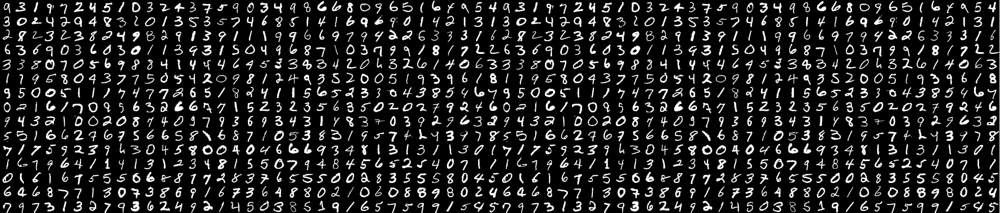

# !!! Рабочиий репозиторий, будет пополняться ошибками по мерепоступления.

## Цель: 
### посмотрим как будет реагировать обучаемость модели на изменение оценки ошибки.
## План: 
### 1. По потерям при использовании классических методов
### 2. Ошибки при классификации.
#### 2.1.1 Binary Cross-Entropy (BCE) — для бинарной классификации
#### 2.1.2 Categorical Cross-Entropy (CCE) — для многоклассовой классификации
#### 2.2 Focal Loss (FL) — модификация кросс-энтропии для несбалансированных данных
#### 2.3 Hinge Loss (L) — применяется в SVM для максимизации разделяющей границы

### 3. Регрессия
#### 3.1 Mean Squared Error (MSE) — среднеквадратичная ошибка, наиболее распространённая функция потерь для регрессии
#### 3.2 Mean Absolute Error (MAE) — средняя абсолютная ошибка, менее чувствительна к выбросам, чем MSE
#### 3.3 Huber Loss (HL) — сочетание MSE и MAE, устойчивая к выбросам
#### 3.4 Log-Cosh Loss (LCL) — логарифм гиперболического косинуса ошибки, дифференцируемая альтернатива MAE

Для моей карты 5060ti установка torch + CUDA: **pip3 install torch torchvision torchaudio --index-url https://download.pytorch.org/whl/cu128**

## 1. По потерям при использовании классических методов

# Кто выжил? (исслелование ошибок и не только для классификации)

Короче тут выжившие больше всего коррелируются с классом, полом и стоимостью билета:

Для обучения классически моделей используется библиотека Scikit-learn, где обучение происходит под капотом, нужно играться гиперпараметрами, выбирая стратегии обучения, пример в файлике **2_obuchenie_logregr.ipynb**, в примере обучается логистическая регрессия, оценка результатов по accuracy и conf_matrix. Более подробно смотри свой политехический диплом, там конвейеры, деревься, бустинги, подбор гиперпараметров в цикле, использование GridSearchCV и пр.

## 2. Ошибки при классификации.

По ошибкам будем экспериментировать на mnist:

Данные будут скапливаться в файлике **3_obuchenie_mnist.ipynb**

#### 2.1 Binary Cross-Entropy (BCE) и Categorical Cross-Entropy (CCE)

В вышеуказанном файлике мульти функция потерь Cross-Entropy реализована с помощью numpy, она рабчая и ееможно редактировать.

#### 2.1 Focal Loss (FL)

В вышеуказанном файлике мульти функция потерь Focal Loss реализована с помощью numpy, она рабчая и ееможно редактировать.

