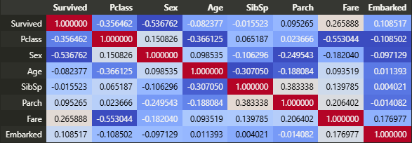

# Кто выжил? (исслелование ошибок и не только для классификации)

## Цель: 
### посмотрим как будет реагировать обучаемость модели на изменение оценки ошибки, будем экспериментировать на пассажирах титаника.
## План: 
### 1. Бинарная классификация
#### 1.1 Binary Cross-Entropy (BCE) — для бинарной классификации
### 2. Многоклассовая классификация
#### 2.1 Categorical Cross-Entropy (CCE) — для многоклассовой классификации

#### 2.2 Focal Loss (FL) — модификация кросс-энтропии для несбалансированных данных
#### 2.3 Hinge Loss (L) — применяется в SVM для максимизации разделяющей границы

### 3. Регрессия
#### 3.1 Mean Squared Error (MSE) — среднеквадратичная ошибка, наиболее распространённая функция потерь для регрессии
#### 3.2 Mean Absolute Error (MAE) — средняя абсолютная ошибка, менее чувствительна к выбросам, чем MSE
#### 3.3 Huber Loss (HL) — сочетание MSE и MAE, устойчивая к выбросам
#### 3.4 Log-Cosh Loss (LCL) — логарифм гиперболического косинуса ошибки, дифференцируемая альтернатива MAE

Для моей карты 5060ti установка torch + CUDA: **pip3 install torch torchvision torchaudio --index-url https://download.pytorch.org/whl/cu128**

Короче тут выжившие больше всего коррелируются с классом, полом и стоимостью билета:

